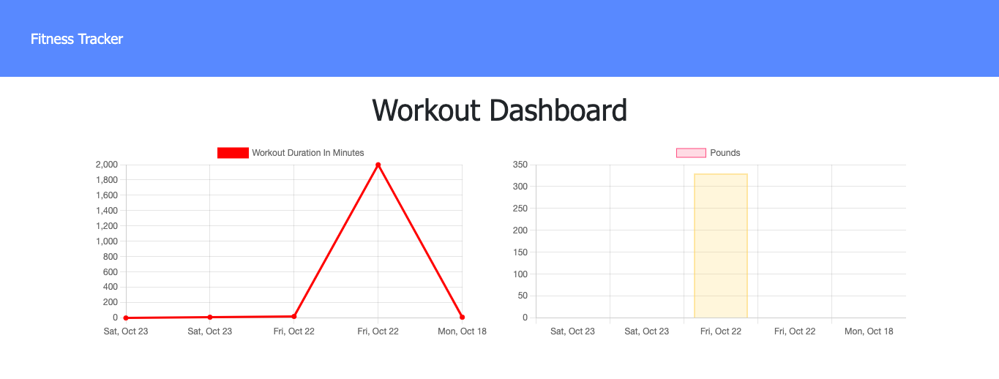

# Fitness Tracker
  
  
  ## Table of Contents
  * [Description](#description)
  * [Installation](#installation)
  * [Usage](#usage)
  * [License](#license)
  * [Contributing](#contributing)
  * [Tests](#tests)
  * [Questions](#questions)
  
  ## Description
  This application allows users to track their workouts.  It is deployed at [bettinson-fitness-tracker.herokuapp.com](https://bettinson-fitness-tracker.herokuapp.com/).

  ## Installation
  Download all files and open in your source code editor.  Run an npm install to ensure all necessary files and node modules are installed on your computer.  Run npm start to begin your application at port 3000

  ## Usage
  Once at either the [Heroku site](https://bettinson-fitness-tracker.herokuapp.com/) or running on your local host, you will be redirected to the home page where you see the most recently logged workout.  
  

  Click “Continue workout” to add another exercise to the most recently logged workout.  Click “New Workout” to create and add exercises to a new workout.  
  

  To see an overview of all logged workouts, click “Dashboard” in the navigation bar.
  
  

  ## License
  This project is registered under the [MIT License](/LICENSE)

  ## Contributing
  * Tiana Bettinson - tbetti
  
  ## Tests
  * N/A

  ## Questions
  * __GitHub:__ [github.com/tbetti](https://github.com/tbetti)
  * __Email:__ [tiana.bettinson@gmail.com](mailto:tiana.bettinson@gmail.com)
   
  
  _This README was created using the [README Generator](https://github.com/tbetti/readme-generator)_
